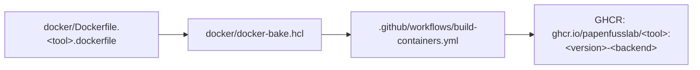

# Multi-Backend Container Build Workflow

This document describes how ProteinDJ's Docker containers are built (CUDA + ROCm) and published
via GitHub Actions, and is a step-by-step checklist for adding a new container to the system.

---

## 1. How the pieces fit together



| File | Role |
|---|---|
| `docker/Dockerfile.<tool>.dockerfile` | One multi-stage Dockerfile per tool. A single `GPU_BACKEND` build arg (`cuda` or `rocm`) selects the base image and the GPU-framework install step; everything else is shared between backends. |
| `docker/Dockerfile.template.dockerfile` | Scaffold to copy when adding a new tool. Not built directly — not referenced by `docker-bake.hcl`. |
| `docker/docker-bake.hcl` | Single source of truth for tags, build args, and dockerfile paths, via [`docker buildx bake`](https://docs.docker.com/build/bake/). One `target` per tool/backend combination, grouped per tool. |
| `.github/workflows/build-containers.yml` | CI. Detects which tool(s) changed (via `dorny/paths-filter`) and runs one `docker/bake-action` job per changed tool, per backend. |

Each tool's images are tagged `ghcr.io/papenfusslab/<tool>:<VERSION>-cuda` / `-rocm`, where
`VERSION` is a variable in `docker-bake.hcl` (currently `v3.0`). This is a **floating tag**:
rebuilding without bumping `VERSION` overwrites the existing tag rather than publishing a new one.
Bump `VERSION` (or add a tool-specific version variable) when you want consumers to be able to
pin to a specific release rather than "whatever is currently published."

---

## 2. Known CUDA/ROCm parity gaps

Not every GPU framework has an equally mature ROCm build. Before wiring up the ROCm side of a new
Dockerfile, check whether the tool depends on any of these:

| Dependency | ROCm status |
|---|---|
| PyTorch | Official ROCm wheels via `--index-url https://download.pytorch.org/whl/rocm<X.Y>`. Straightforward. |
| JAX | ROCm builds exist but lag behind CUDA releases and rarely match a pinned CUDA version exactly. |
| DGL | No official ROCm wheels; building from source is non-trivial and may not be supported at all. |
| OpenMM | CUDA/OpenCL platforms are standard; there is no `openmm[rocm]` pip extra. |
| Custom CUDA kernels (e.g. SE3Transformer-style extensions) | Usually hard-coded to CUDA; assume no ROCm support unless verified. |

If a tool depends on one of the problem cases above, it's fine to ship CUDA-only — just omit the
`-rocm` bake target and build job for that tool rather than forcing a broken ROCm build.

---

## 3. Adding a new container

### 3.1 Create the Dockerfile

1. Copy the template:
   ```bash
   cp docker/Dockerfile.template.dockerfile docker/Dockerfile.<tool>.dockerfile
   ```
2. Fill in every `<PLACEHOLDER>`: base images (pin a specific tag, not `:latest`), repo URL +
   pinned commit SHA, Python version, apt/pip dependencies, and the CUDA-vs-ROCm GPU package
   install block.
3. If the tool has no viable ROCm path (see §2), delete the `elif [ "$GPU_BACKEND" = "rocm" ]`
   branch's real install and leave it erroring out (or just don't create a `-rocm` bake target —
   see §3.2).

### 3.2 Register it in `docker-bake.hcl`

Add a `group` and one `target` per backend, following the existing `fampnn`/`bindcraft` pattern:

```hcl
group "<tool>" {
  targets = ["<tool>-cuda", "<tool>-rocm"]  # drop "-rocm" if not supported
}

target "<tool>-cuda" {
  dockerfile = "Dockerfile.<tool>.dockerfile"
  args = {
    GPU_BACKEND = "cuda"
  }
  tags = ["${REGISTRY}/<tool>:${VERSION}-cuda"]
  platforms = ["linux/amd64"]
}

target "<tool>-rocm" {
  dockerfile = "Dockerfile.<tool>.dockerfile"
  args = {
    GPU_BACKEND = "rocm"
  }
  tags = ["${REGISTRY}/<tool>:${VERSION}-rocm"]
  platforms = ["linux/amd64"]
}
```

Add `"<tool>"` to the `default` group's `targets` list so it's included in full builds.

### 3.3 Test the build locally before touching CI

```bash
cd docker
docker buildx bake <tool> --set "*.push=false"
```

This builds (but doesn't push) every target in the `<tool>` group, using your local Docker
daemon. Fix any build errors here first — it's much faster to iterate locally than via CI.

### 3.4 Add a build job to the workflow

In `.github/workflows/build-containers.yml`:

1. Add a filter entry under the `changes` job so edits to this tool's Dockerfile (or
   `docker-bake.hcl`) are detected:
   ```yaml
   <tool>:
     - 'docker/Dockerfile.<tool>.dockerfile'
     - 'docker/docker-bake.hcl'
   ```
   and add `<tool>: ${{ steps.filter.outputs.<tool> }}` to the `changes` job's `outputs`.
2. Copy an existing `build-<tool>` job block (e.g. `build-fampnn`), rename it, point its `if:` at
   `needs.changes.outputs.<tool>`, and set its matrix to `[<tool>-cuda, <tool>-rocm]` (or just
   `[<tool>-cuda]` if there's no ROCm target).

This keeps each tool's rebuilds isolated — editing one tool's Dockerfile won't trigger a rebuild
of every other container.

### 3.5 Push and verify

Push to a branch covered by the workflow's `push.branches` filter (or use **Run workflow** /
`workflow_dispatch`, which always runs regardless of which files changed). Confirm in the Actions
tab that only the job(s) for the tool you touched ran.

### 3.6 Pull the built image with Apptainer

These are regular multi-layer OCI images, so use the `docker://` transport (not `oras://`, which
is for single-layer SIF artifacts):

```bash
apptainer pull <tool>_<version>-cuda.sif docker://ghcr.io/papenfusslab/<tool>:<version>-cuda
```

If the GHCR package is private, authenticate first:
```bash
apptainer remote login --username <gh-username> --password <PAT-with-read:packages> docker://ghcr.io
```

---

## 4. Checklist summary

- [ ] Copy `docker/Dockerfile.template.dockerfile` → `docker/Dockerfile.<tool>.dockerfile`, fill in placeholders
- [ ] Confirm ROCm viability of GPU dependencies (or go CUDA-only)
- [ ] Add `group`/`target` blocks to `docker/docker-bake.hcl`, add tool to `default` group
- [ ] `docker buildx bake <tool> --set "*.push=false"` locally to validate the build
- [ ] Add a `changes` filter entry and a `build-<tool>` job in `.github/workflows/build-containers.yml`
- [ ] Push and confirm only the new tool's job(s) run
- [ ] Pull with `apptainer pull ... docker://...` to confirm the published image works
